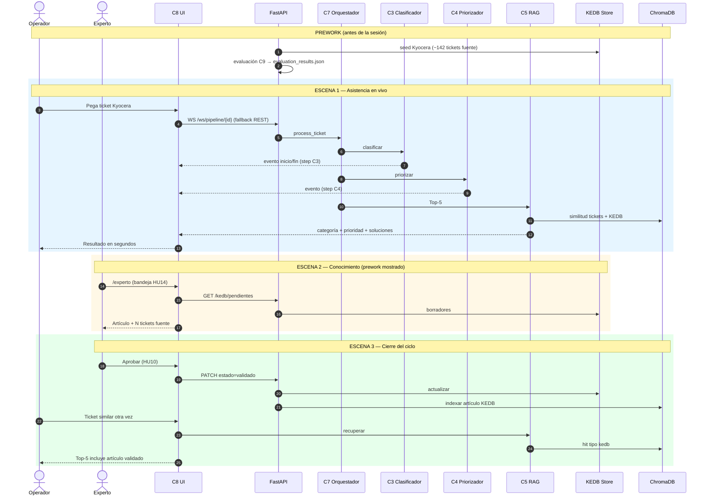
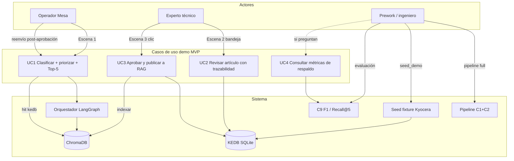
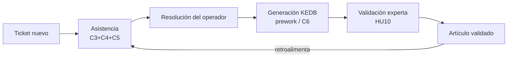

# Guía de demo — Plataforma RAG + KEDB

Checklist operativa para la sesión con el patrocinador (OITSI-MTC).  
Guion narrativo y argumentario: ver [`DEMO.md`](../DEMO.md) (complementa `PRD.md` §2.4 y §10.1–10.2).

---

## Flujos y casos de uso

### Secuencia de la sesión (prework → 3 escenas)



### Quién dispara qué



### Ciclo cerrado asistencia ↔ KEDB



- **Escena 1** = valor inmediato para el operador.
- **Escena 2** = evidencia de conocimiento generado (no se genera en vivo).
- **Escena 3** = el clic que cierra el ciclo: lo aprobado vuelve a RAG.

---

## Precondiciones

1. `docker compose up --build` corriendo (api, worker, web, chromadb, redis)
2. `Tickets_Consolidados.xlsx` en `data/raw/`
3. `.env` con `OPENAI_API_KEY` válida (o `EMBEDDING_PROVIDER=local` si hay cuota insuficiente)
4. Health OK:

```bash
curl -s http://localhost:8000/health
```

---

## Prework (antes de la sesión)

```bash
# 1. Pipeline de datos (muestra top-9 → processed + Chroma)
docker compose --profile pipeline run --rm pipeline full

# 2. Artículo KEDB Kyocera limpio (~142 tickets fuente) + golden sample + métricas C9
#    Idempotente: borra borradores Kyocera previos y deja exactamente 1 pendiente limpio.
docker compose exec api python scripts/seed_demo.py
# Alternativa: curl -X POST http://localhost:8000/kedb/seed-demo
# seed-demo también reindexa el clúster Kyocera con resoluciones operativas largas (Escena 1).
# Si solo necesitas ese reindex: docker compose --profile pipeline run --rm pipeline enrich-kyocera

# Si ya practicaste Escena 3 (artículo validado en RAG/Live Docs), reset completo:
# docker compose exec api python scripts/reset_demo.py
```

Si `seed_demo` no pudo calcular evaluación (sin `tickets_eval.json` o fallo de embeddings), encolar:

```bash
curl -X POST http://localhost:8000/metrics/evaluacion
# Esperar a que el worker termine; luego:
curl -s http://localhost:8000/metrics/evaluacion
```

**No ejecutar en vivo frente al cliente:** `POST /kedb/generate` ni el botón «Generar borradores» en Experto (riesgo de clúster/LLM inconsistente).

---

## Go / no-go (verificar antes de abrir la sala)

| Check | Comando / acción | Criterio |
| :--- | :--- | :--- |
| API | `curl http://localhost:8000/health` | `"status":"ok"` |
| Pendientes (HU14 bandeja) | `curl http://localhost:8000/kedb/pendientes` | **Exactamente 1** borrador Kyocera (título TaskAlfa 7003i, no “Test edit…”) |
| Trazabilidad | Abrir artículo en UI Experto | Badge **~142 tickets fuente** (o N del extract real) |
| Métricas | `curl http://localhost:8000/metrics/evaluacion` | `muestra_tickets` > 0; ver nota F1/Recall abajo |
| UI | http://localhost:3000 | Operador carga |

Si Chroma está vacío o la API key falla: Escena 1 puede degradar (sin Top-5 útiles). Preferir reintentar pipeline/embeddings antes de la demo.

---

## Escena 1 — Asistencia en vivo

1. Abrir http://localhost:3000
2. Pegar: *"Impresora Kyocera 7003 no imprime, necesito que la configuren de nuevo"*
3. Clic en **Enviar ticket**
4. Mostrar steps del pipeline (eventos WebSocket reales; si falla WS, hay fallback REST)
5. Mostrar categoría, prioridad Media, Top-5 soluciones

**Tickets de respaldo (otro dominio, si hace falta variedad):**

- *"Sin acceso a escritorio remoto"* (VPN / GlobalProtect; ticket histórico 66487)
- *"Problemas de conexión remota vía VPN"* (ticket 95813)

---

## Escena 2 — Conocimiento generado (prework, no generar en vivo)

1. Ir a http://localhost:3000/experto
2. La bandeja de pendientes es la **alerta HU14** de esta demo (pull vía `GET /kedb/pendientes` + badge). No hay email/push.
3. Abrir el artículo Kyocera pre-sembrado
4. Mostrar trazabilidad N:1 (**HU09**) y el conteo de tickets fuente (~142)
5. Opcional: **Editar (HU10)** título/síntoma/causa/solución → Guardar (sigue en borrador)

---

## Escena 3 — Cierre del ciclo

1. Clic en **Aprobar (HU10)** — el artículo sale de pendientes; alert de éxito
2. Volver a Escena 1 (Operador) con un ticket similar Kyocera
3. Enviar de nuevo y **señalar** en el Top-5 un hit con `tipo: kedb` (artículo validado indexado en RAG)

---

## Cifras de respaldo (solo si preguntan)

```bash
curl -s http://localhost:8000/metrics/evaluacion
```

En esta versión: F1 macro y Recall@5 (caché precomputada). Kappa no se calcula.

**Cómo interpretarlas (importante ante el patrocinador):**

- **F1 macro:** clasificación sobre una muestra del split `eval` (típicamente 50 tickets). Meta PRD ≥ 0.80.
- **Recall@5:** métrica **simplificada** de esta build — cuenta hit solo si el mismo `ticket_id` del query reaparece en el Top-5. Eso subestima el Recall “de negocio” (soluciones semánticamente útiles de otros tickets). Un valor bajo (p. ej. 0.20) **no** invalida la Escena 1: en demo se juzga por relevancia de las soluciones mostradas, no por esta cifra.
- No hace falta proyectar las metas del PRD salvo que pregunten; si lo hacen, aclara la definición simplificada de Recall@5.

---

## Advertencia de anonimización (PII)

`data/raw/Tickets_Consolidados.xlsx` / `artifacts/Tickets_Consolidados.xlsx` es el export **sin anonimizar** (nombres de solicitante/técnico). Los textos de esta guía se revisaron; cualquier ticket extra debe pasar por C1 o revisión manual antes de mostrarlo en pantalla.

---

## Fallbacks rápidos

| Problema | Acción |
| :--- | :--- |
| Top-5 genérico / una línea | `pipeline enrich-kyocera` o `POST /kedb/seed-demo` (reindexa resoluciones enriquecidas) |
| Tras practicar Escena 3 (artículo ya validado) | `docker compose exec api python scripts/reset_demo.py` |
| Métricas en 0 | Re-correr `python scripts/seed_demo.py` o `POST /metrics/evaluacion` |
| WS no conecta | La UI usa REST automáticamente; la demo sigue |
| OpenAI sin cuota | `EMBEDDING_PROVIDER=local` en `.env` y rebuild |
| Preguntan por Recall@5 bajo | Explicar métrica simplificada (ver sección cifras de respaldo) |
